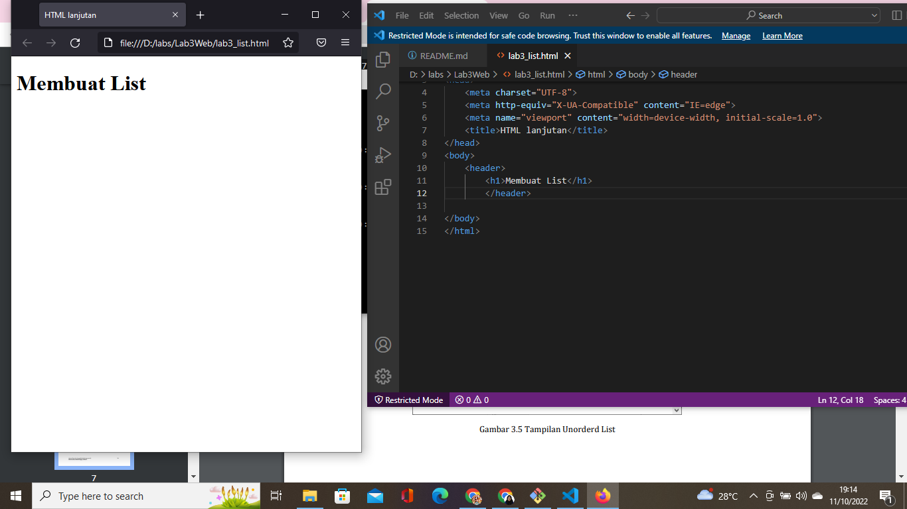
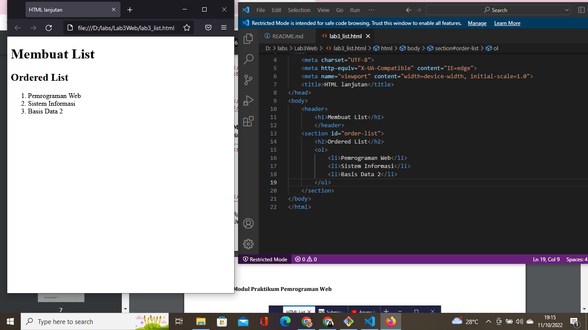
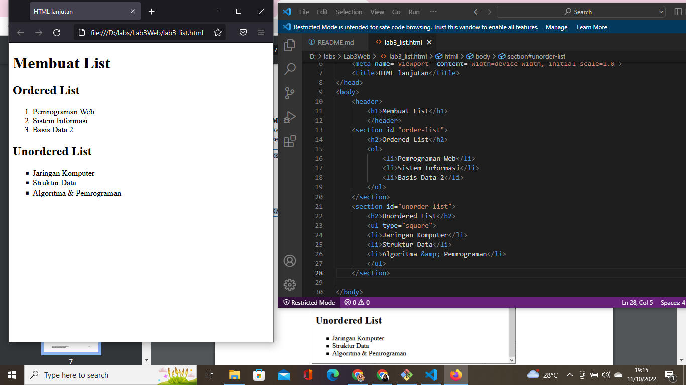
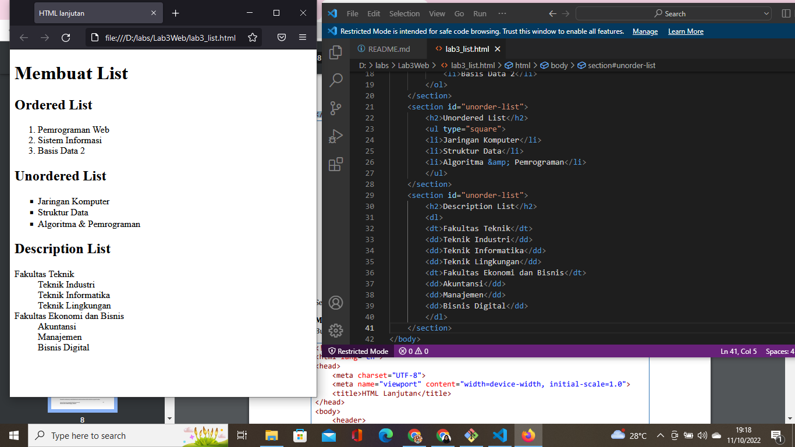
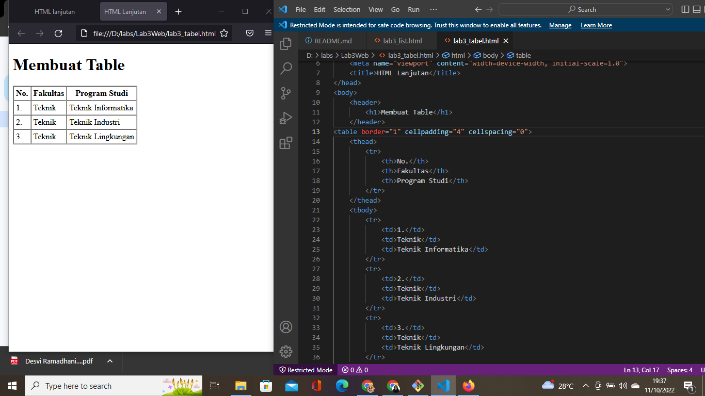
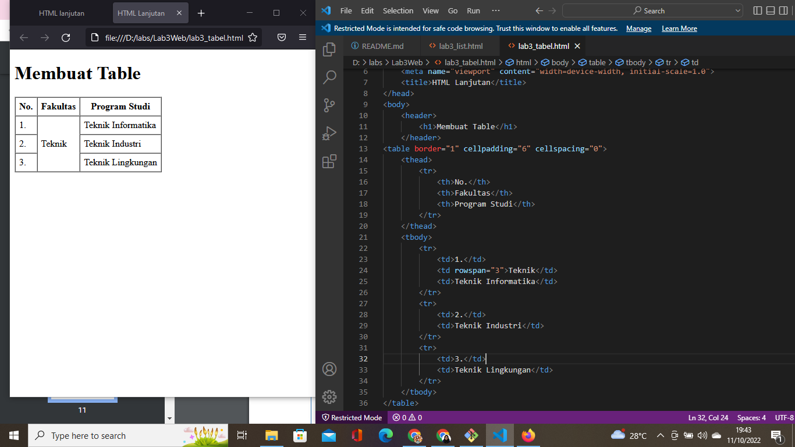
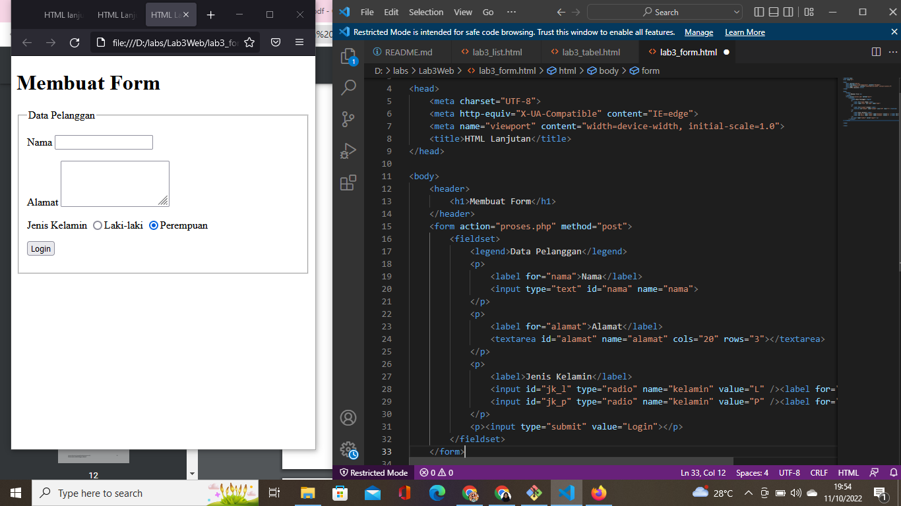
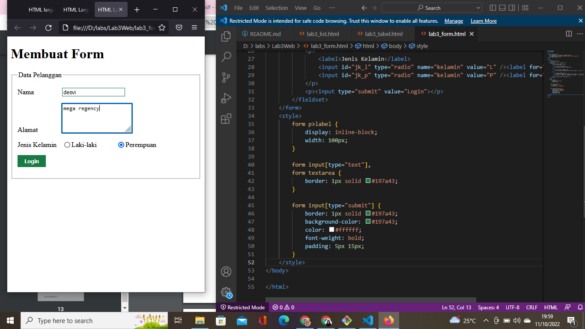

# Lab3Web

## Belajar Membuat List, Tabel, dan Form

### Membuat Ordered List, Unordered List, dan Description List
Pertama, buatlah dokumen html dengan nama file lab3_list.html dengan tampilan seperti ini :

Kedua, tambahkan lah kode untuk membuat ordered list seperti ini:

Ketiga, tambahkan lagi kode untuk membuat unordered list, setelah deklarasi ordered list dengan tampilan seperti ini:

dan yang terakhir, buat lahkode untuk description list setelah deklarasi unordered list. Begini tampilannya:

### Membuat Tabel
Pertama, buat lah file dengan nama lab3_tabel.html lalu tambahkan lah kode untuk membuat tabel dengan tampilan berikut:

dan yang terakhir, mengatur margin, padding dan menggabungkan sel data. Mengatur margin dan padding menggunakan atribut cellpadding dan cellspasing pada tag tabel. Sedangkan untunk menggabungkan sel data menggunakan atribut rowspan(vertikal) dan colspan(horizontal). Disini saya memakan atribut rowspan yang berguna untuk menggabungkan barisan secara vertikal. Beginlah tampilannya:

### Membuat lab3_form.html
Pertama, Buatlah file dengan nama lab3_form.html lalu masukkan kode untuk membuat tabel sebagai berikut:

dan yang terakhir, menambahkan styke pada form agar form jadi terlhiat lebih menarik dengan menggunakan CSS sebagai berikut:
